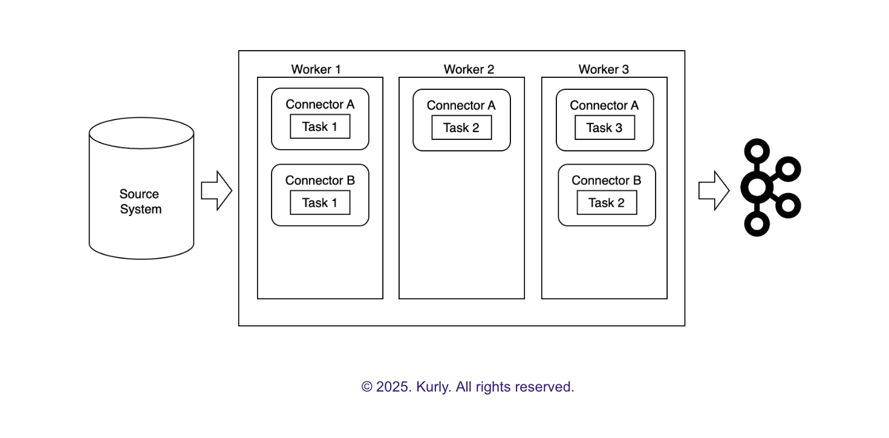
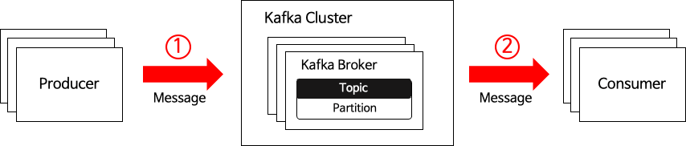
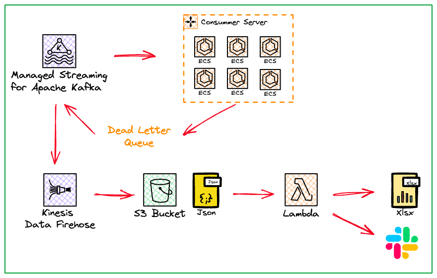

>해당 아티클 정리는 귀로 들으며 정리하는 포스팅입니다.  
>구글의 NotebookLM으로 요약한 내용을  
>라디오처럼 재생해 들으며 공부하고 있습니다.🎧

 

## 테스트 코드 중요성, 효과적인 테스트 전략

### 테스트 코드가 중요한 이유

테스트 코드에 대해 각 기업의 생각은 다음과 같다.

🍎 애플

기능 검증, 버그 조기에 발견, 코드 유지보수성, 협업 도움, 전반적인 코드 품질과 안정성 확보 면에서 좋다.

💙 토스

새로운 기능을 만들 때 검증하고, 기존 기능 수정 시 회귀 테스트 필요하다.

현실에서는 테스트코드 작성이 왜 어려울까?

가장 큰 이유는 작성해야할 테스트의 절대적인 양이 많다는 것.
또다른 문제는 구현 코드랑 밀접하게 엮여서 깨지기 쉬운 테스트(fragile test)가 될 수 있다는 점.

💛 카카오페이

서비스가 복잡해지고 외부 시스템 의존성이 늘어나면서 테스트코드를 작성하고 유지보수가 어려워져서 개발 생산성이 오히려 떨어진다는 점.

### 그렇다면 좋은 테스트란, 어떤 조건을 갖춰야할까?

토스에서는 **FIRST** 규칙을 소개한다.

- *Fast*: 빠르게 동작하기
- *Indenpendant*: 독립적으로 실행 가능하기
- *Repeatable*: 반복해도 같은 결과 내기
- *Self-Validating*: 스스로 검증하기
- *Timely*: 적시에 작성되기

애플에서도 독립성, 반복가능성, 명확성, 빠른 실행, 지속적인 유지보수를 강조한다.

토스는 여기에 더불어, **완전성(테스트코드를 이해하는데 필요한 모든 정보가 코드 내에 명확히 드러나야 한다)** 과 **간결성(불필요한 내용은 빼고 핵심 검증 로직에 집중해야 한다)** 을 이야기한다.

하지만 이러한 원칙보다 더욱 중요한 것은

>그 테스트가 과연 비즈니스적으로 가치있는가?(Valuable Test)가 제일 중요하다.

테스트 커버리지 숫자만 높이기 위해서 작성된 실질적인 문제 발견이나 안정성 향상에 기여하지 못한 테스트는 그저 시간 낭비일 뿐이라는 거다.

### 토스팀에서 이야기한 가치 있는 테스트 코드 전략이란?

1. 모든 것을 테스트하려 하지 않고 작성 가치를 따져서 선택적으로 작성한다. => 핵심 기능 20%에 집중해서 80%의 신뢰도 확보하기!
2. 최대한 실용적으로 작성한다. => 통합 테스트 작성으로 테스트 코드의 총량 줄이기!
3. 테스트의 확실한 목적에 따라 구분해서 작성하기

그럼 실제 코드 레벨에서 어떤 전략을 다루는지 살펴보자.

토스팀에서 도메인 정책 테스트를 단위/유닛 테스트로 작성한다고 한다. ex) 만 19세 미만은 특정 이벤트에 참여하게 할 수 없다

외부환경이나 데이터베이스 의존성 없이 해당 로직만 빠르게 확인하는데 목적이 있다. 토스는 이런 단위테스트를 작성할 때 테스트 대상을 *SUT(System-Under-Test)* 라고 부른다. SUT와 협력이 필요한 객체가 있을 수 있다는데 이를 **협력자** 라고 부른다. 이는 테스트 대역일 수도 있고 실제 객체일 수도 있다.

**테스트 대역의 종류**
- Dummy(인자로 전달되지만 실제 사용안되는)
- Spy(호출됐는지 기록하는)
- Stub(정해진 값을 반환하는)
- Mock(특정 메서드가 예상대로 호출되는지 검증하는)
- Fake(실제 객체처럼 동작하지만 운영에서는 쓰지 않는)

실제 객체를 두고 테스트를 하자 => *고전파(Classicist)*
테스트 대역(특히 Mock 객체)을 두고 테스트를 하자 => *런던파(London School, Mockist)*

토스에서는 실제 객체를 활용하는 것을 더욱 유용할 거라고 했는데, 이유는 테스트 대역을 사용할 때, 테스트 작성 속도를 높이고 복잡한 의존성 작성을 피할 수 있는 장점이 있지만, <ins>SUT의 내부 구현과 강결합이 생기게 되어 테스트가 실패할 수 있다는 단점이 있다.</ins>(즉, 구현이 바뀌면 테스트가 깨져버리는..) 또한, 테스트 코드의 복잡한 사전 설정 과정 때문에 비즈니스 로직보다 이해하기 어려워지면서 문서화의 역할 또한 하지 못하는 특징도 있다.

**토스의 유스케이스 테스트**
사용자의 실제 시나리오를 검증하는 인수 테스트이자 통합테스트 방식으로 작성된다. API 명세 외에 세부 구현을 모르는 상태의 블랙박스 테스트로 작성했다.

각 테스트가 서로 영향을 주지 않고 독립적으로 실행되게 하기 위해 테스트 시작 전, 필요한 데이터를 DB에 준비시키고(set-up) 테스트가 끝난 후에는 깨끗하게 정리(tear-down)한다.

토스팀에서는 JSON 파일을 이용하는데 초반에는 SQL을 사용할 때 테이블 구조 변경과 같은 관리가 번거로워서 더 유연하고 용이한 JSON 방식을 채택했다.

**테스트 대역 활용 시**

토스 외부 서비스인 경우
- Fake 객체 구현

토스 내부 서비스인 경우
- 비즈니스 외적인 부수효과가 존재하는 경우: Dummy 객체를 사용
- 데이터 확보가 어려운 경우: 모의 객체 프레임워크(Mockito)를 통해 Stub 사용
- 그 외 대부분의 경우: 실제 객체를 사용

**토스의 직렬화/역직렬화 테스트**

토스에서는 <ins>카나리 배포 전략</ins>을 취하고 있다.
>카나리 배포란? 새로운 버전의 코드를 일부 사용자에게만 먼저 배포하고 점진적으로 확대하는 배포 방식

여기서 문제는 이전 버전과 새로운 버전과의 호환성 문제이다.
이런 경우 캐시 버저닝 전략이 필요한데 이걸 꼼꼼하게 매번 챙기기 어렵다.

토스에서는 이러한 테스트 실패를 하나의 신호로 가져가 검증한다고 한다.

카카오페이는 외부 파트너 서비스와의 http 통신을 테스트하기 위해 Mock 서버를 띄워 직접 사용했다고 한다.

하지만 이 방식은 연동하는 외부 서비스가 많아지고 각 서비스마다 다양한 응답 시나리오가 필요한 상황이 되자 비효율 문제가 발생했다고 한다.

대안으로, 스프링부트의 @MockBean을 사용하는 것인데, 이는 외부 서비스와 통신하는 역할을 한다. 즉, Bean 자체를 mocking하는 것!

하지만 이를 사용하면서 전체 테스트 실행 시간이 길어진다는 문제가 발생했다. 스프링은 테스틑 실행 속도를 높이기 위해 동일한 설정을 사용하는 테스트 클래스 간에는 *Application context* , 즉 <ins>애플리케이션 실행에 필요한 모든 Bean 객체와 설정 정보를 담고 있는 컨테이너를 한 번만 만들어서 캐싱하고 재사용(Context Caching)한다</ins> @MockBean을 사용하면 각 테스트 클래스마다 고유한 Mock 설정을 가지게 되니까 스프링은 컨텍스트를 재사용하지 못하고 매번 새로 만들게 된다. 그렇기에 계속 늘어나는 테스트 클래스 때문에 컨텍스트 로딩 시간 누적이 되고 전체 빌드 시간이 길어지는 문제가 발생하게 되는 것이다.

카카오페이는 이를 해결하기 위해 테스트 환경 전용 설정 클래스, @TestConfiguration을 만들고 그 안에 Mock 객체를 정식 Bean으로 등록하게 된다. 이로 인해 스프링은 Mock 객체를 일반 Bean으로 인식하고 컨텍스트를 재사용하게 된다. 

>테스트 코드 환경은 운영환경과 철저히 분리되어야 한다!

느낀점: 현재 프로젝트 상황에 맞게 가장 가치 있는 테스트 전략은 무엇일지 끊임없이 고민하는 것은 개발자의 지속적인 과제라는 것을 이번 아티클을 통해 확실히 느끼게 되었다. 정답이란 없고, 때에 따라 그에 맞는 용이한 테스트 코드를 짜는 것이 중요한 것 같다!

>🔗 https://d2.naver.com/helloworld/9921217  
>🔗 https://toss.tech/article/test-strategy-server  
>🔗 https://f-lab.kr/insight/backend-test-code-writing-20240716  
>🔗 https://tech.kakaopay.com/post/mock-test-code/  

---

## Kafka 데이터 유실, 중복 방지

데이터베이스의 데이터를 카프카랑 어떻게 하면 쉽게 연결할 수 있을까? 또 그 과정에서 안정성은 어떻게 확보할까?에 대한 내용이다.

마켓컬리와 올리브영의 사례를 보면서 정리해보자.

💜 마켓컬리

컬리는 여러 종류의 데이터베이스를 쓰면서 통합에 어려움을 겪어 카프카의 커넥트를 도입했다고 한다.

### Kafka Connect란?
다양한 데이터소스(RDBMS, NoSQL, File System 등)들을 카프카랑 쉽게 연결하기 위한 다리 역할이다. 개발자가 직접 코드를 짜지 않고 JSON 형식의 설정 파일 만으로 데이터 파이프라인을 만들 수 있다는 점!

내부적으로는 어떻게 돌아가고 있는걸까?

출처: 마켓 컬리 테크 블로그

카프카 커넥트라는 전체 프레임워크가 있고 그 위에 Worker라는 프로세스가 돌아간다. 

Worker는 설정 파일을 받아내고 Connector라는 카프카 커넥트 내부의 실제 메시지 파이프라인을 만들어서 관리한다.(카프카 커넥트 프로세스가 실행되는 서버 또는 인스턴스)

Connector는 실제 데이터 복사 작업의 task(thread 레벨로 수행)라는 작은 실행 단위를 만들어서 병렬로 돌린다.

그렇다면 데이터 변환 작업 시에는 어떻게 되는 걸까?

### Converter와 TransForm

**Converter** 는 데이터가 쓰는 언어를 바꾸는 역할.(DB에서 나오는 데이터를 카프카가 알아듣기 쉽게 json이나 avro 등 포맷으로 변환)

**Transform** 은 다른 말로 *SMT(Single Message Transform)* 이라 한다. 데이터가 담고 있는 내용을 바꾼다.(특정 필드를 추가하거나 불필요한 정보를 빼거나, 값의 형식을 바꾸는 등)

마켓 컬리는 JDBC 소스 커넥터를 사용했는데, 이는 주기적으로 SQL 쿼리를 날려 데이터 변경을 감지한다.

### 증분 쿼리 모드(Incremental Query Mode)
커넥터가 마지막으로 처리했던 데이터 특정 값(ex. 자동으로 증가하는 ID, PK, 타임 스탬프)을 offset으로 기억한다. 이후 이전에 처리된 데이터는 건너뛰고 새로운 데이터만 추출하도록 한다.

컬리는 이를 이용하여 CDC(Change Data Capture)로 활용한다.

### CDC(Change Data Capture)란?
데이터베이스나 시스템의 데이터 변경점을 모두 추적하여 이를 외부 시스템으로 전달하는 기술

두 가지가 있다.

- **로그 기반**
  - DB 내부의 트랜잭션 로그를 읽어서 변경 내역을 실시간으로 감지
  - 장점: 실시간으로 변경점 잡아냄. DB 부하 적음. 삭제 및 변경 등의 모든 이벤트를 놓치지 않음.
  - 단점: 구현 복잡함. DB의 높은 권한 필요. 설정 까다로움. DB 종류마다 로그 분석 방식 다를 수 있음.
- **쿼리 기반**
  - 장점: 주기적으로 쿼리 실행하여 데이터를 추출하기 때문에 구현 간단. 쿼리를 실행하기 위한 읽기 권한만 있으면 된다. 로그 의존도 낮음. 구축 비용 낮음.
  - 단점: 데이터 누락이 발생할 수 있음.(삭제, 갱신, 데이터베이스 트랜잭션 지연으로 이벤트 발생 순서와 실제 DB에 반영되는 순서가 달라질 때)

쿼리 기반의 단점 중 하나인 순서가 꼬이는 문제를 해결하기 위해 컬리에서는 **timestamp.delay.interval.ms** 를 사용했다. 즉, 지연시간을 주는 것이다.(ex. 5분에 쿼리 실행하면, 지연시간을 2분으로 잡았을 때 3분까지의 데이터만 카프카에 적재시키는 것)

이 옵션을 적용할 때 주의사항은 이 값이 클수록 그만큼의 적재까지의 지연도 증가한다는 점이다.(실시간성 저하)

상황에 맞게 균형 있는 설정을 하도록 하자!

🫒 올리브영

올리브영은 대규모 주문 관리시스템 OMS를 구축하면서 기존의 복잡했던 EAI 와 Batch 방식 대신 Kafka를 전면 도입해서 성능을 3배에서 45배로 증가시켰다고 한다.

Kafka의 특징 중 하나인 Exactly-once guarantees이 있는데, Kafka는 Delivery Semantics를 설정할 수 있는데 크게 세 가지가 있다.

### Message Delivery Semantics
- **At most once**: 최대 한 번은 메세지가 중간에 유실될 수는 있지만 중복은 안된다.
- **At least once**: 최소한 한 번은 유실은 없지만, 중복은 발생할 수 있다.(Kafka의 기본값)
- **Exactly once**: 정확히 한 번은 유실도 없고 중복도 없이 딱 한 번만 전달된다. 구현이 가장 까다로움.

올리브영은 사용자의 거래 정보와 같은 민감한 데이터들을 다루고 있기 때문에 Exactly once 수준의 신뢰성을 확보하는게 프로젝트의 핵심 과제였다.

그렇다면 메시지의 유실과 중복은 어느 단계에서 발생하고, 올리브영은 어떻게 이 핵심 과제에 대한 과제를 해결하려고 했을까?

출처: 올리브영 테크 블로그

메세지를 보내는 쪽(Producer)와 Kafka Broker 사이, 메시지를 받는 쪽(Consumer)와 Kafka Broker 사이 두 구간으로 나눠서 보자.

**메세지를 보내는 쪽(Producer)와 Kafka Broker 사이**

여기서 유실은 간단하다. 네트워크 문제로 도착을 제대로 못했을 수 있다. 이를 막기 위해 acks=all과 retry 옵션을 사용했다.

여기서 acks=all은 모든 응답을 다 확인한다는 뜻이다. 이는 중간의 Broker 하나에 문제가 생겨도 데이터가 유실된 가능성을 줄일 수 있다. retry 설정을 통해 실패하면 재시도도 할 수 있도록 한다.

retry 시도로 중복 메시지가 발송될 경우, 멱등성을 이용하여 막아낼 수 있다. enable.idempotence=true 설정을 통해 Producer가 메시지를 보낼 때마다 고유한 id랑 순서 시퀀스 번호를 붙여서 보낸다. Broker는 이 id와 시퀀스 번호를 보고 중복 저장을 알아서 막아낸다.
=> 이는 Kafka 3.0 부터는 기본 옵션으로 설정되어 있다고 한다.

**메시지를 받는 쪽(Consumer)와 Kafka Broker 사이**

유실(ex. Consumer가 재기동 될 때, Broker에 메시지가 적재되는 경우 => auto.offset.reset=earliest 사용, spring.kafka.listener.immediate-stop=false 우아한 중단 사용)

중복(ex. Consumer는 자신이 처리한 정보를 오프셋에 정리해서 Broker에 커밋을 해주어야 한다. 만약 어떠한 문제로 커밋이 되지 않았다면? Broker는 Consumer가 안받은 줄 알고 다시 메시지를 전달하지만, 이미 Consumer는 처리된 메시지이므로 중복 문제 발생!
=> AcksMode=MANUAL_IMMEDIATE(즉시 수동 커밋) 사용, spring.kafka.listener.immediate-stop=false 우아한 중단 사용
)

이 외에도 메시지 처리시간이 길어 중복이 발생한 경우가 있다고 한다.

Consumer가 Broker로부터 메시지를 한 번 가져간 뒤에(poll) 다음 poll 요청까지 허용되는 최대 시간(max.poll.interval.ms)이 있다. 이를 초과했을 때, Broker는 문제가 있다고 생각하고 해당 Consumer를 제외해버린다.(kicked out) 이후 다른 Consumer에게 넘겨준다.(Rebalancing)

이에 대한 해결 방법으로 버전 업이나 session.timeout.ms, heartbeat.interval.ms, max.poll.interval.ms 설정값을 조정해서 컨슈머에게 여유를 주는 방식, 메시지 처리 로직을 최적화해서 문제가 발생하지 않도록 하는 방법이 있다.

### Kafka 고가용성 보장과 MSK 보안성 패치 이슈

1. Broker 다중화(Multi-AZ): 브로커 서버들을 하나의 데이터 센터가 아니라 여러 개의 분리된 가용 영역에 나눠서 배치하는 것
2. Replication Factor: 데이터 복제본 수
3. Min In-Sync Replicas: Producer가 보낸 메시지가 성공적으로 저장되었다는 응답을 받기 위해 최소한 몇 개의 복제본이 동기화 되어야 하는지

**Min In-Sync Replicas + acks=all** 같이 설정하면 메시지 유실 방지할 수 있다!

**CooperativeSticky Strategy** -> Rebalancing 시에 기존 Partition 할당을 최대한 유지한 채로 필요한 부분만 다른 Consumer에게 옮긴다.

### DLQ(Dead Letter Queue) 자동 백업 시스템 구축

1. DLQ 데이터 적재
2. AWS Kinesis Data Firehose 데이터 캡쳐
3. S3 에 Json 파일로 저장
4. AWS Lambda 함수로 Json 파일을 Xlsx 파일로 변환
5. 백업 성공 시 SNS 호출
6. Slack 을 통해 DLQ 적재 및 백업 상태 알람

출처: 올리브영 테크 블로그

느낀점: 대용량 데이터를 실시간으로 안정성 있고 빠르게 처리하기 위한 고민들을 새롭게 알 수 있었다. 중요한 메시지들을 잃지 않도록 단단하게 설계하는 고민읙 과정을 볼 수 있어서 좋았다!

>🔗 https://helloworld.kurly.com/blog/kafka-connect-pipeline/ 
>🔗 https://oliveyoung.tech/2024-10-16/oliveyoung-scm-oms-kafka/

---

## Vite

### 왜 Webpack에서 Vite로 바꿨는가?

카카오 MY구독 서비스는 5년전 리액트 16버전, 웹팩 4버전으로 시작되었다.
최근에는 리액트 19버전으로 업데이트 되어있다. 스토리북으로 컴포넌트 개발 진행했다.

최신 기술 도입 과정(리액트 19 정식 버전으로 업데이트)에서 기존 프로젝트 내의 의존성이 꼬여버린 현상이 발생했다.

>웹팩 그대로 써도 되는가?

HMR도 빠르고 프로덕션 빌드도 안정적이었는데 왜 바꾸는 걸 고려해야 할까?

5년간 업데이트 작업이 많아지면서 웹팩 설정 파일이 점점 커지고 복잡해져서 관리가 어려워졌다.

설정 복잡도, 호환성, 생태계를 기준으로 빌드 도구 선정했다.(성능 및 속도 보다는 생태계의 힘을 중시)

### Vite의 특징

1. 설정 파일이 웹팩보다 훨씬 간단하고 직관적이라는 특징이 있다!
2. 웹팩은 번들링으로 시작하는데, vite는 esm 방식으로 필요한 파일로 그때그때 브라우저가 요청해서 사용한다.(초기 로딩이나 hmr 속도 빠른 이유)
3. rollup 사용과 생태계 크다는 특징이 있다.
4. 프로젝트 규모가 클 수록 사용하기 좋다.

### Parcel의 특징
1. 제로 config => 설정 없이 바로 쓸 수 있다.
2. 복잡한 요구사항의 프로젝트에는 안 맞을 수 있다.
3. 생태계 작다.

### RsBuild의 특징
1. rust 기반 => 성능 좋고 빌드 속도 빠르다.
2. 웹팩 호환성 good
3. 가장 큰 약점은 생태계 부족..

### 엄청난 속도 향상 vs 검증되고 풍부한 생태계와 안정성

**왜 Vite를 택했을까?**

1. 설정의 복잡도 -> 중간 정도의 vite 승
2. 호환성 -> 스토리북과의 호환성 고려
3. 생태계 -> llm도 추천할 정도의 생태계(오..)
4. 성능 -> RsBuild보단 느리지만 웹팩보단 빠르다

마이그레이션 작업 후 결과는?
**간편해진 설정** , **빨라진 컴파일 시간과 hmr**

느낀점: 5년간 이어온 프로젝트 마이그레이션 작업 쉽지 않을텐데 순작업 시간 3일만에 끝낸 카카오 개발자들 멋있다!

> 🔗 https://tech.kakao.com/posts/770

---

## Kafka의 내부 작동 방식

Apache Kafka의 스토리지 구조와 KRaft 프로토콜에 대한 내용이다.

우리가 Kafka에 메시지를 보내면 디스크 어딘가에 저장될텐데 어디에 저장되는걸까?

Kafka Broker 설정 파일의 **log.dirs** 파라미터가 있는데, 이것이 카프카가 데이터를 저장할 디스크 상의 디렉토리 경로를 지정하는 역할을 한다.

카프카를 쓸 때 topic과 partition 단위로 데이터를 나누는데, 디스크에도 partition 별로 파일이 하나씩 생기는 걸까?

=> 실제로는 물리적으로 더 잘게 쪼개져 있다. 하나의 데이터는 여러 개의 세그먼트 파일 조각으로 나뉘어서 저장된다.

왜 언제 세그먼트로 나눌까?

=> 관리의 효율성 때문이고 현재 사용 중인 세그먼트(활성 세그먼트)의 크기가 특정 임계값에 도달했을 때 나뉘어진다.

그럼 세그먼트 파일들은 어떤 걸로 구성되어 있는걸까?

=> 각 세그먼트는 단순히 데이터 뿐만 아니라 효율적인 검색과 관리를 위해 세 가지 종류의 파일로 구성된다.

1. **.log** : 실제 메시지 데이터가 저장되는 곳(메시지 offset, timestamp, key, value, header 등)
2. **.index** : 모든 offset 정보가 아닌 일정한 간격마다 상대 offset과 해당 메시지가 .log 파일 내에 저장된 물리적 위치를 매핑한 정보만 드문드문 저장한다.
3. **.timeIndex** : 시간 기반 검색을 효율화하기 위함. 메시지 timestamp와 그 시점의 offset을 매핑하는 정보를 저장한다.

### DumpLogSegments란?

성능 향상을 위해 여러 메시지를 묶어 batch 단위로 저장한다. .log file에 실제 메시지 데이터가 순차적으로 batch 단위로 쌓인다.

그렇다면 특정 번호의 메시지를 찾고 싶다면 어떻게 해야 할까?

=> index 파일에서 targetOffset 이하의 가장 큰 오프셋을 이진 탐색으로 찾고, 거기 적힌 position으로 .log를 탐색한 뒤 앞으로 순차 스캔해서 targetOffset 레코드에 도달하면 읽는다.

인덱스를 너무 드물게 하면 검색 속도가 느려지고, 인덱스를 많이 설정하면 저장과 캐시 비용과 부하라는 트레이드 오프가 있다. 서비스 상황에 맞게 조절 필요!

이렇듯 카프카는 디스크 기반임에도 불구하고 대용량 데이터를 매우 효율적이고 빠르게 읽을 수 있는 것이다!

### KRaft 프로토콜

Kafka는 오랫동안 *Zookeeper* 를 이용했다. 클러스터의 중요한 정보(메타데이터들(topic 정보 Broker 상태 등))를 관리하고 파티션마다 리더를 뽑는 역할을 Zookeeper에게 맡겼다.

하지만 이런 외부시스템의 의존성에서 벗어나고자 만들어진 것이 KRaft이다. 

카프카가 자체적으로 **Raft 합의 알고리즘** 을 사용해서 메타데이터를 관리하도록 만든 것이다. 가장 큰 장점으로, 운영이 훨씬 단순해졌고, 잠재적 병목 현상이나, 외부 시스템과의 상태 불일치 문제가 근본적으로 해결된 점이다.

### Raft 합의 알고리즘이란?

분산 시스템에서 여러 노드들이 어떻게 합의를 보는지에 대한 구체적인 방법론으로 보면 된다.

크게 다음과 같은 3가지 문제로 나누어서 해결한다.

1. **리더 선출(Leader Election)**: 여러 노드 중에서 누가 리더 역할을 할 지 민주적으로 정하는 과정.
2. **로그 복제(Log Replication)**: 리더가 정해진 후, 클러스터의 모든 변경 사항(새로운 topic을 만든다거나 설정을 바꾸는 등)은 반드시 리더를 통해서만 처리된다. 리더는 이 변경 요청을 받으면 먼저 자신의 로그에 순서대로 기록한다. 이후, 다른 노드들에게 로그에 적으라고 전달한다.
3. **안전성 규칙(Safety Rule)**: 시스템이 어떤 예외적인 상황에서도 이상하게 돌아가지 않도록 여러 안전 장치를 마련해둔다.

>그러면 카프카 클러스터에서 어떤 노드들이 KRaft를 수행할까?

모든 Broker가 참여하는 게 아닌, KRaft 모드에서는 모두의 역할을 설정 파일(process.roles)에서 지정할 수 있다. 일부 노드는 컨트롤러 역할로 특별히 지정한다.

*컨트롤러 노드들이 모여 Quorum 이룸 => Raft 프로토콜에 따라 활성 컨트롤러 선출*

여기서 리더로 선출된 하나의 노드는 **활성 컨트롤러** 가 된다.

일반 Broker 노드들은 활성 컨트롤러부터 최종적으로 확정된 메타데이터 로그를 받아 자신의 상태를 최신으로 유지한다.

Kraft에서는 옵서버 역할을 하는 Broker 노드나 팔로워 상태인 컨트롤러 노드가 메타데이터를 동기화할 때 **pull 기반 복제 방식** 을 사용한다.

### 여기서 pull 방식이란?
Broker나 팔로워 컨트롤러가 주기적으로 활성 컨트롤러에게 *fetch RPC* 라는 요청을 보낸다. 간단히 말해서 "로그 지금 여기까지 받았는데 혹시 최신 메타데이터 나온 거 있음 주세요~"하고 물어보는 것! 그러면 활성 컨트롤러가 응답을 해준다.

## 동적 Quorum 관리 지원

Kraft는 동적 Quorum 관리 지원하기 때문에 카프카 서비스를 중단하지 않고도 컨트롤러 노드를 추가하거나 제거하는 것이 가능하다. <ins>한 번에 하나씩만 가능하다!</ins> Quorum이 둘 이상으로 쪼개져서 서로 다른 리더를 선출하게 되는 문제(split brain)를 방지해야 한다!

느낀점: 방대하다..! 카프카에 대해 이렇게 내부 구조를 이해해 볼 수 있어서 매우 유익했다. 안에서 이루어지는 원리들이 정말 세세하게 알고리즘으로 잘 이루어져 있다는 것을 볼 수 있었다.

>🔗 https://rohithsankepally.github.io/Kafka-Storage-Internals/  
>🔗 https://developers.redhat.com/articles/2025/09/17/deep-dive-apache-kafkas-kraft-protocol