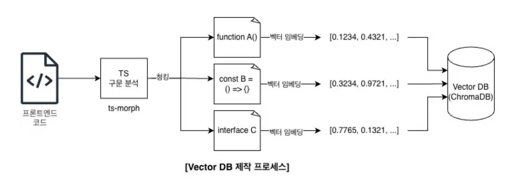

>해당 아티클 정리는 귀로 들으며 정리하는 포스팅입니다.  
>구글의 NotebookLM으로 요약한 내용을  
>라디오처럼 재생해 들으며 공부하고 있습니다.🎧

 

## AI 개발 도구와 코드 리뷰 자동화 전략

### 코드 어시스턴트

GitHub Copilot와 Codeium

개발자가 코드를 입력할 때 실시간으로 다음 코드를 제안해주거나 주석을 쓰면 코드 블록 전체를 지원해준다.

DataRobot
특정 분야(ex. 머신러닝 모델 개발 지원) 전문 분야에 대해 특화되어있다. 

깃클리어의 보고서에 따르면, AI 어시스턴트를 사용한 후에 코드 중복이 엄청 늘어난다는 문제가 발생한다고 한다.

5줄 이상 중복되는 코드가 8배나 증가한 반면, 리팩토링은 줄어들었다.

이는 AI 어시스턴트 작업의 큰 문제다. 

이는 개발 속도는 빨라지겠지만 장기적으로는 코드 베이스가 커지고 중복 코드가 많아지므로 유지보수가 매우 힘들어진다.

구글의 Dora 데브옵스 보고서에 따르면, AI가 개별 코드 조각의 품질은 향상한다 해도 전체 시스템의 변경 안정성은 떨어진다고 한다.

### 코드 리뷰

개발 시간의 20~30%를 차지하는 코드 리뷰.. 코드 리뷰의 부담적인 부분과 주관적인 부분 문제를 AI가 해결해줄 수 있을까?

AI 기반 코드 분석 도구들은 크게 2가지 방식으로 접근한다.

1. SonarCube
2. Codee

>정적 분석 기법으로 코드를 분석하는 것이 코드이 의미나 맥락까지 알 수 있을까?

이는 핵심 한계점 중 하나이다. AI가 메모리 누수같은 저수준 오류는 잘 수정할 수 있지만, 복잡한 비즈니스 로직의 오류나 API를 올바르게 사용했는지에 대한 문제는 사람이 잘 판단한다.

결국 AI만으로는 완벽한 리뷰가 어렵다. AI와 사람이 함께 하이브리드 방식으로 코드 리뷰하는 것이 Best!

실제 토스의 LLM 기반 자체 리뷰 시스템을 구축한 사례를 보면 장단점을 명확히 확인해볼 수 있다.

장점으로는,

1. 빠른 피드백
2. 일관된 기준 적용 가능
3. 리뷰 대기 시간 단추 
4. 일관된 코드 스타일

단점으로는,

1. 전체 시스템과 diff가 어떻게 상호작용하는지, 숨겨진 부작용이 있는지 파악이 어려움
2. 변경된 코드양이 많으면, LLM의 입력값 한계 발생(토큰 제한)
3. 보안의 위험성
4. 불안정한 응답 가능성

이러한 문제를 해결하기 위해 프롬프트를 정교하게 만들거나, RAG(검색 증강 생성 기법)를 활용해서 LLM이 사내 코드 가이드라인이나 문서를 참조해서 답변하도록 만드는 것이 필요하다.

### 테스트

안정적인 소프트웨어를 위해선 테스트는 필수적이다.

AI는 테스트 코드의 초안 생성에 아주 효과적이다. 여러  상황(사용자가 어떤 특정행동을 할 때, UI 상태가 어떻게 변하는지, 특정 시간대의 버그 찾기)의 테스트 하는 코드를 AI가 빠르게 작성을 해준다.

토스는 여러 컴포넌트의 상호작용을 확인하는 통합 테스트를 선호한다고 한다. 통합 테스트의 현실성을 높이기 위해 Mock 사용을 지양하고, 가능한 한 실제 객체를 사용한다고 한다. 데이터 구조 변경과 같은 문제의 호환성을 잡기 위해 승인 테스트도 활용한다고 한다.

>무엇을 테스트할 것인가?  
>AI가 생성한 테스트코드가 정말 올바른가? 어떻게 개선할 것인가?

이는 사람이 해결해야할 과제들이다.

>통합 테스트 자체가 가지는 어려움(테스트 환경 설정의 복잡함, 네트워크 상태와 같은 외부요인, 반환값 없는 것)

이는 AI가 해결할 중요한 과제들이다.

AI에 대한 의존도가 높아지면서 AI 문맹 개발자가 늘어나고 있다.

>AI는 대체재가 아닌 "도구"라는 점을 잊지 말자.

개발자는 앞으로 더 복잡한 시스템의 아키텍처를 설계하고 핵심 비즈니스 로직을 구현하고 AI가 생성한 코드의 품질과 맥락을 파악하는 등 더 높은 수준의 문제 해결에 집중해야 한다.

개발자의 역할은 Coder에서 Orchestrator의 역할로 진화했다.

느낀점: AI에 너무 의존하지 말고 대체제가 아닌 도구로 생각하자. 코드의 원리를 이해하고 서비스를 크게 들여다볼 수 있는 능력이 현재 개발자에게 요구되는 역량이라고 생각한다. AI가 효율적으로 작업을 도와주지만, AI가 작업한 것을 판단하는 것은 개발자의 몫이다. 근본을 잃지 말자!

>🔗 https://blog.scordi.io/%EC%83%9D%EC%84%B1%ED%98%95-ai-%ED%88%B4-%EC%B6%94%EC%B2%9C   
>🔗 https://notavoid.tistory.com/280  
>🔗 https://www.slexn.com/ai-%EA%B8%B0%EB%B0%98-%EC%BD%94%EB%93%9C-%EB%B6%84%EC%84%9D-%EC%96%B4%EB%94%94%EA%B9%8C%EC%A7%80-%EB%AF%BF%EC%9D%84-%EC%88%98-%EC%9E%88%EC%9D%84%EA%B9%8C-%E3%85%A1-codee/  
>🔗 https://soyoondaily.com/entry/AI-%EA%B8%B0%EB%B0%98-%ED%85%8C%EC%8A%A4%ED%8A%B8-%EC%BD%94%EB%93%9C-%EC%9E%91%EC%84%B1-%EA%B0%80%EC%9D%B4%EB%93%9C-%E2%80%93-%EA%B0%9C%EB%B0%9C-%EC%83%9D%EC%82%B0%EC%84%B1%EC%9D%84-%EB%86%92%EC%9D%B4%EB%8A%94-%EB%B0%A9%EB%B2%95  
>🔗 https://byline.network/2025/02/25-379/  
>🔗 https://jaimemin.tistory.com/2727  
>🔗 https://toss.tech/article/test-strategy-server  
>🔗 https://velog.io/@yaza/%EC%BD%94%EB%93%9C-%EB%A6%AC%EB%B7%B0-%EC%9E%90%EB%8F%99%ED%99%94-%EC%8B%9C%EC%8A%A4%ED%85%9C-%EA%B5%AC%EC%B6%95%ED%95%98%EA%B8%B0-w-ollama-1%ED%8E%B8-Proof-of-Concept  
>🔗 https://motivator.jiransecurity.com/trend/98  

---

## OpenStack의 핵심 개념과 작동 원리

### 오픈스택(OpenStack)
가상 자원을 모아서 private이나 public 클라우드를 만들고 관리하는 오픈 소스 플랫폼이다. 이외에도 Kubernetes, CloudStack 등이 있다.

컴퓨팅, 네트워킹, 스토리지 핵심 클라우드 서비스를 제공해준다. 이외에도 다양한 기능을 제공한다. 이 기능들을 조합해서 사용자가 원하는 클라우드 환경을 구축할 수 있도록 한다.

가상화 관리 플랫폼과는 다른 개념이다. 가상화된 자원 위에서 작동한다는 점, 여러 Vendor 환경에서 자원을 찾고 자동화할 수 있다는 점은 맞다.
하지만, 가상화 관리 플랫폼은 주로 이미 있는 가상 자원의 기능을 더 쉽게 쓰도록 조작하기 쉽게 만드는데 중점을 둔다.(ex. 호텔 관리 객실 시스템) 오픈스택은 그 가상 자원을 활용해서 아예 클라우드 환경 자체를 구축한다.(ex. 호텔 전체를 짓고 운영하는 시스템)

### 오픈스택의 작동 방식

오픈스택의 본질은 스크립트다. 다음 두 가지 소프트웨어로 인해 돌아간다.

1. **가상화 기술**: 하드웨어에서 자원을 분리해서 추상화된 가상 리소스 계층을 만든다.
2. **운영체제**: 오픈스택이 내린 명령을 실제로 실행하는 기반이 된다.

오픈스택 자체가 서버를 가상화하진 않는다. 이미 만들어진 가상화된 자원을 가져다 쓰는 것이다. OS 스크립트 명령을 전달하는 역할!

### 오픈스택의 핵심 기술
1. *Keystone*: 클라우드 전체의 보안 검색대 역할. 사용자가 누구인지 인증하고 어떤 서비스에 접근할 권한을 관리해준다.
2. *Nova*: 실제 자원인 가상 서버의 역할. 사용자가 가상머신(예를 들어 VM) 만들어달라고 요청하면, 필요한 컴퓨팅 자원을 찾아 가상머신을 생성하고 관리한다.
3. *Neutron*: 가상머신들이 서로 통신하거나 외부 인터넷에 연결될 수 있도록 네트워크 배관을 연결해주는 역할.

위 세 가지가 가장 기본적인 뼈대다. API로 서로 연결시킬 수 있다.

### 오픈스택은 어디에 활용할 수 있을까?
1. *Private 클라우드 구축*: 기업이 자체 데이터센터로 직접 클라우드 환경을 만들 때 많이 사용한다고 한다.
2. *네트워크 기능 가상화(NFV)*: 주로 통신사에서 기존 라우터나 방화벽 같은 장비의 기능을 소프트웨어로 구현해서 여러 환경에 유연하게 배포할 때 많이 사용한다.
3. *Public 클라우드 구축*
4. *Container 배포/운영*: 오픈스택 위에서 컨테이너를 운영하면, 애플리케이션 배포 속도를 향상할 수 있고 관리가 용이하다.

느낀점: 가상화 관리 뿐만 아니라 직접 가상화 환경을 구축한다는 기술이라는 것을 확실하게 알게 되었다! 알아보니 많은 해외/국내 기업에서 OpenStack을 통해 클라우드 환경을 구축하고 있어, 그 넓은 활용 범위가 인상적이었다!

>🔗 https://www.redhat.com/en/topics/openstack  

---

## RAG와 Vector DB로 생산성과 코드 품질 향상시키기

여기어때에서 반복적인 작업 해소를 위해 팀의 코드 스타일과 패턴을 학습한 Diffy와 @pwb/testgen을 구축했다.

RAG(Retrieval-Augmented Generation)와 Vector DB를 선택한 이유는 무엇일까?

>모델을 직접 파인튜닝하면 되지 않을까? 왜 RAG를 선택했을까?

내부 코드를 외부 LLM 학습 데이터에 넘겨야 하는 보안 문제와 비용적인 부분, 최신 내용을 빠르게 반영하기 어렵다는 파인튜닝의 단점들 때문이다.

반면, RAG는 내부 코드를 외부에 노출시킬 필요가 없고 Vector DB에 저장된 최신 코드 조각들을 LLM이 답변 생성할 때 실시간으로 참조할 수 있어 자유롭다는 장점이 있다.

즉 RAG는 다음과 같이 의미한다.

### RAG(Retrieval-Augmented Generation)
AI가 답변 만들기 전에 관련 자료를 먼저 검색하여 참고하도록 하는 방식

### Vector DB
코드 조각들을 효율적으로 저장하고 검색할 수 있게 해주는 특수한 데이터베이스. 단순히 키워드가 일치하는 걸 찾는 게 아니라 코드의 의미. 즉, 어떤 문제를 어떻게 해결하는 코드인가를 숫자의 배열로 표현하고 사용자 질문과 의미적으로 유사한 조각을 빠르게 찾아내서 AI에게 전달한다.(의미 기반 검색)

RAG는 때때로 파인튜닝에 준하거나 더 나은 성능을 보인다고 한다.

실제로 마이크로소프트 리서치 연구에서, 일부 모델에서 RAG가 더 나은 성능과 답변 정확도를 보였다고 한다.

>그렇다면 Vector DB에 방대한 코드 조각들을 어떻게 담아냈을까?

`chunking` 과정이 중요하다.

### chunking

AI가 정보를 잘 소화하고 검색할 수 있도록 코드를 의미 있는 단위로 나누는 작업.

chunking을 사용하지 않고 너무 긴 코드를 벡터로 만들면 여러 로직이 뒤섞여버리는 일이 발생한다. 이렇게 되면 벡터가 가지는 의미가 모호해진다!

코드의 문법 구조를 분석하는 방식(**AST: 추상 구문 트리**)을 활용한다. AST는 컴파일러가 코드를 이해하는 방식처럼 코드의 구조를 트리 형태로 표현한 것이다.

`ts-morph`라는 라이브러리를 사용하여 AST를 수행했다고 한다.

### Vector DB

Vector DB는 오픈소스인 Chroma DB를 사용했다. 간단한 사용법과 로컬 및 운영 환경 구축 용이성, 메타데이터 필터링 기능 면에서 좋다. git 레포지토리로 별도의 컬렉션을 만들어 프로젝트 간 코드 맥락이 섞이지 않도록 관리했다.

>코드 조각을 벡터로 변환하는 임베딩 모델은 어떤 걸로 사용한 걸까?

회사에서 주로 사용하는 Gemini embedding 모델(gemini-embedding-001)을 사용했다. 세밀한 의미 차이 구분과 비용 차원에서 선정. 45분이나 걸렸던 임베딩 처리를 500개씩 묶어서 batch 처리하는 방식으로 바꿔 8분이라는 시간으로 최적화 작업을 진행했다.

### 자동 업데이트 파이프라인 구축
GitLab CI/CD로 dev 브랜치에 새로운 코드가 푸쉬될 때마다 변경된 파일만 감지하여 해당 부분의 벡터만 Vector DB에 자동으로 업데이트 되도록 했다.

덕분에 AI는 항상 최신 코드를 학습하게 된다.

### 테스트 코드 자동 생성
AI는 입력 값에 대해 Vector DB에서 관련성 높은 기존 코드와 팀 스타일 가이드를 참조해서 그에 맞는 테스트 코드를 작성해준다.(디자인 명세나 최근 변경 등의 다양한 맥락을 이해해서 테스트를 만들어준다 대박 자주 발생하는 오류 패턴도 파악한다!)

개발 워크플로우에 자연스럽게 녹아들도록 npx generate 명령어를 통해 쉽게 사용할 수 있도록 했다.

테스트 주도 개발을 팀 내 확산하는 데 기반이 되었다.

### AI 코드 리뷰어 Diffy
Merge Request는 최소 2명 이상이 어푸룹해야 한다는 규칙이 있는데 GitLab Webhook을 이용해서 Diffy가 즉시 작동되도록 한다.

RAG를 이용하여 diff만 보는 게 아니라 세 가지 정보(변경된 코드 자체, Vector DB의 의미적으로 유사한 기존 코드 조각들, 팀의 코드 작성 문서)를 함께 고려하여 리뷰를 한다.

>그렇다면 어떤 종류의 피드백을 주는가?
프롬프트 엔지니어링으로 변경된 코드 라인에 대해서만 리뷰를 작성하라는 명확한 지시와 불필요한 코드, 엣지 케이스 처리 미흠, 코드 중복, 사용하지 않는 변수, 룰 위반 사항들이 있는지 직접적으로 보도록 했다.

단, 주관적인 피드백(리팩토링 같은 부분)은 넣지 않았다고 한다.

즉, 명확한 기준에 대한 검증은 AI가, 주관적인 판단이나 전체 아키텍처에 대한 평가는 사람이 하는 것이다.

느낀점: RAG로 직접 코드 리뷰와 테스트 코드를 만들어 냈다는 것.. 생산성 부분에서 AI를 활용한 혁신적인 방법이라고 생각한다. 리뷰를 할 때마다 꼼꼼하게 코드를 보면서 자잘한 실수는 없는지 확인하는 데 시간이 꽤 걸렸는데 AI가 이걸 대체하고 또한 팀의 코드 스타일을 기반으로 리뷰해주고 테스트를 해준다면 정말 편할 것 같다. DX 향상의 대표적인 케이스 같다.

>🔗 https://techblog.gccompany.co.kr/%EC%9A%B0%EB%A6%AC-%ED%8C%80-%EC%BD%94%EB%93%9C-%EC%8A%A4%ED%83%80%EC%9D%BC%EC%9D%84-%EC%95%84%EB%8A%94-ai-%EB%A7%8C%EB%93%A4%EA%B8%B0-rag%EC%99%80-vector-db-%ED%99%9C%EC%9A%A9%EA%B8%B0-94532d92b0a3  
>🔗 https://techblog.gccompany.co.kr/%EC%9A%B0%EB%A6%AC-%ED%8C%80-%EC%BD%94%EB%93%9C-%EC%8A%A4%ED%83%80%EC%9D%BC%EC%9D%84-%EC%95%84%EB%8A%94-ai-%EB%A7%8C%EB%93%A4%EA%B8%B0-%ED%85%8C%EC%8A%A4%ED%8A%B8%EC%BD%94%EB%93%9C-%EC%9E%91%EC%84%B1-gitlab-mr-%EB%A6%AC%EB%B7%B0-%EB%A7%8C%EB%93%A4%EA%B8%B0-07e573e7648e  
---

## Amazon DynamoDB 아키텍처

아마존 내부에서 DynamoDB 전 처음에는 어떤 시스템을 썼고, 어떤 문제를 겪었고, 그것이 어떻게 DynamoDB로 발전했는지의 과정을 알아보자.

아마존의 기존 관계형 데이터베이스는 아마존의 성장 속도를 따라가는 것이 버거웠다고 한다. 아마존의 쇼핑카트를 생각하면, 데이터가 실시간으로 변화하고 트래픽도 오르락내리락 하기 때문에 항상 안정적인 데이터베이스가 필요했다.

DynamoDB는 분산 시스템에서 가용성이나 확장성 면에서 뛰어났지만,결정적인 단점으로는 **싱글 테넌트** 방식이 있었다.

### 싱글 테넌트
한 팀이 직접 설치부터 운영까지 독점적으로 진행한다는 구조를 뜻한다.

운영 부담이 컸기에 그 대안으로 **Simple DB** 서비스를 많이 썼다.

### Simple DB
테이블 기반 모델의 완전 관리형 서비스로 운영 부담은 훨씬 적다. 하지만 테이블 하나 당 저장 용량이 딱 정해져 있고 처리량도 낮다. 모든 속성을 다 인덱싱해서 응답 속도를 예측하기가 어렵다. 이런 단점이 있다.

### DynamoDB

- *완전관리형 클라우드 서비스*: 데이터베이스 운영의 복잡한 관리(소프트웨어 업데이트, 하드웨어 관리, 서버 설정, 백업, 장애 복구 등)에서 해방된다. 개발자는 코드 짜기에만 집중하면 된다.
- *멀티 테넌트 아키텍처*: 여러 고객의 작업을 같은 하드웨어에서 돌려서 비용 효율을 높이는 방식이다. 워크 로드 격리는 각 고객의 요청한 자원(처리량)을 미리 할당한다.
- *테이블 크기 무제한과 밀리초 수준의 평균 응답시간*

>DynamoDB에서 데이터 보호, 고가용성은 어떻게 보장하는가?

사용자 데이터는 하나의 AWS region 안에서도 물리적으로 떨어진 가용영역(AZ)에 자동으로 복제된다. 그렇기에 한 AZ에 문제가 생겨도 서비스는 계속 돌아간다.

Global Table이라는 기능을 쓰면, 여러 AWS region에 걸쳐 데이터를 복제할 수 있다. => 데이터 속도 어디서든 빠름, 문제 생겨도 서비스 중단되지 않음!

>DynamoDB는 키-값 저장소이며, 문서 데이터베이스 특징이 있다.

즉, 개발 중에 속성을 바꿀 수 있다는 장점이 있다.

### DynamoDB의 내부 동작 방식

테이블 데이터는 사용자가 정한 Partition Key를 기준으로 여러 개의 파티션으로 나뉘어 저장된다.

내구성과 가용성을 높이기 위해 각 파티션 데이터는 서로 다른 AZ의 여러 서버에 복제를 한다. 이 복제본들의 묶음을 **복제 그룹** 이라고 한다.

>그렇다면 쓰기 요청이 들어오면 데이터 일관성은 어떻게 맞추는가?

Multi-Paxos라는 합의 알고리즘을 사용한다. 각 복제 그룹 안에는 리더 역할을 하는 복제본이 있다. 모든 쓰기 요청은 이 리더가 받아서 처리한다. 리더는 쓰기 요청을 받으면 쓰기 요청 로그라는 곳에 기록하고 다른 복제본들한테 뿌린다.

[카프카 내부 작동 방식의 Raft 합의 알고리즘](https://chae-ri.dev/posts/article-reviews_2025-10-27_2025-11-02/#kafka%EC%9D%98-%EB%82%B4%EB%B6%80-%EC%9E%91%EB%8F%99-%EB%B0%A9%EC%8B%9D)과 비슷한 원리인 것 같다.

클라이언트 요청은 요청 라우터라는 큰 분산 시스템에 도착한다. 이 라우터는 몇 가지 중요한 일을 한다.

1. AWS IAM과 연동해서 이 사용자가 요청할 권한이 있는지 확인
2. 요청에 들어있는 Partition Key를 보고 이 데이터가 실제 어느 파티션, 스토리지 노드에 있는지를 알려주는 메타데이터 서비스에서 라우팅 정보를 획득
3. 사용자가 할당 받은 처리량(RCU/WCU)을 넘어서는 요청인지 Admission Control으로 확인

이 모든 과정을 통과하면 요청이 성공적으로 처리된다.

### MemDS
모든 메타데이터를 여러 MemDS 서버 메모리에 분산시키고 각 요청 라우터는 MemDS 데이터를 캐싱하는 로컬 캐시를 갖는다.

라우터는 일단 로컬 캐시를 쓰고 비동기적으로 MemDS에 요청해서 최신 캐시 상태로 유지하도록 한다. 결과적으로 라우터가 추가되어도 메타데이터 서비스 부담 없이 빠르고 안정적으로 메타데이터를 가져올 수 있게 된다.

>특정 데이터에만 요청이 몰리는 Hot Partition은 어떻게 대처할까?

### Hot Partition
테이블 전체 용량은 아직 많이 남았는데 특정 파티션에 트래픽이 집중되면 파티션 용량 한계를 넘어 요청이 거부된다.(Throttling)

크게 두 가지로 해결할 수 있다.

1. *Bursting*: 각 파티션이 안쓰고 남겨둔 처리량, 테이블 전체에서 남는 용량을 일시적으로 빌려와서 짧은 시간 동안의 트래픽 폭증을 흡수하는 방식이다.(잠깐 용량을 초과해서 쓸 수 있게 해주는 방식)
2. *Global Admission Control(GAC)*: Bursting은 이미 터진 문제에 대응하는 방식이라면, GAC는 미리 움직이는 방식이다. 중앙 시스템이 테이블 전체의 남은 용량을 실시간으로 계속 추적한다. 그래서 요청 라우터들이 요청을 처리하기 전에 허가를 받는 방식이다.

### 데이터 내구성
쓰기 전 로그(WAL)는 복제도 되지만 S3에 백업도 된다. 여러 서버에 동시에 문제가 생겨도 S3에 저장된 로그를 통해서 데이터를 복구할 수 있다. 

비트 손상 같은 오류는? => DynamoDB는 체크섬을 이용한다. 데이터를 네트워크로 보낼 떄, 디스크에 저장할 때, 데이터에 디지털 지문 같은 체크섬을 붙여놓는다. 이 체크섬을 확인해서 데이터 변조 여부를 체크한다.

### 고가용성

장애를 감지하고 대응하는 과정에서 DynamoDB는 한 복제본이 리더에게 말하기 전에 다른 동료 복제본들한테 물어본다. 나만의 문제인지 아닌지 판단하게 되는 것이다. 

이렇게 불필요한 교체를 최소화하고 시스템 안정성을 높이게 된다.

느낀점: 처음엔 단순한 데이터베이스 이야기인 줄 알았는데, 아마존이 시행착오를 많이 겪었고 그걸 해결하면서 지금의 DynamoDB가 만들어졌다는 점이 흥미로웠다. 한 서비스가 안정적으로 돌아가기까지 얼마나 많은 고민과 선택이 쌓여 있는지 느껴졌다. 기술 자체보다 왜 이런 구조가 필요했는지 이해하게 되면서, 분산 시스템이 생각보다 훨씬 현실적인 문제 해결에서 출발했다는 걸 알 수 있었다!

>🔗 https://blog.bytebytego.com/p/a-deep-dive-into-amazon-dynamodb  