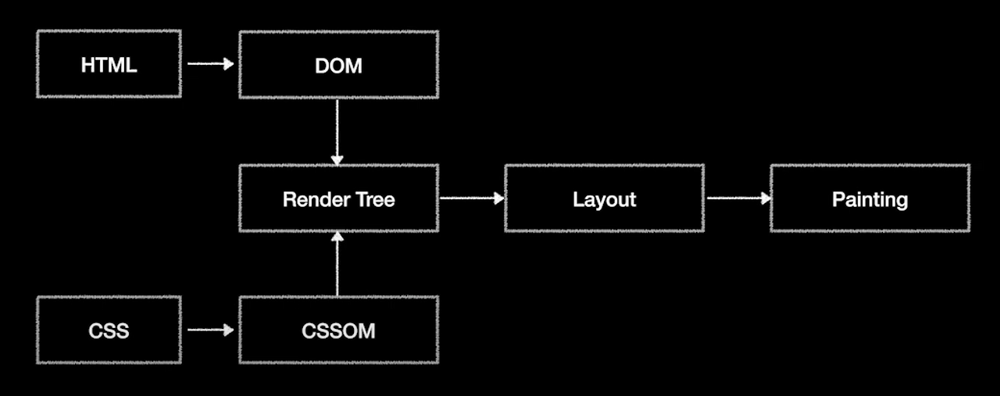
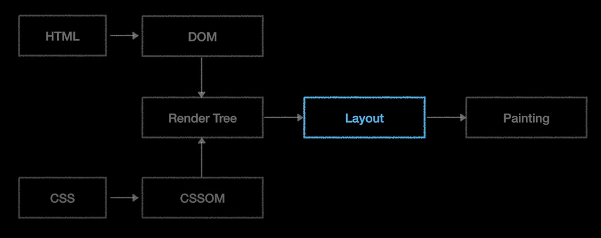
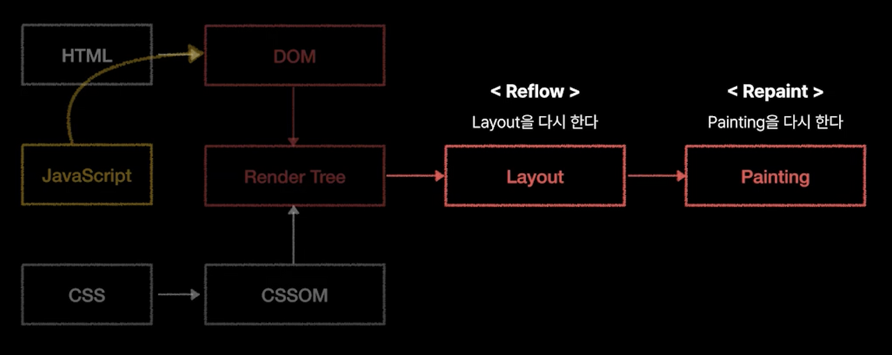
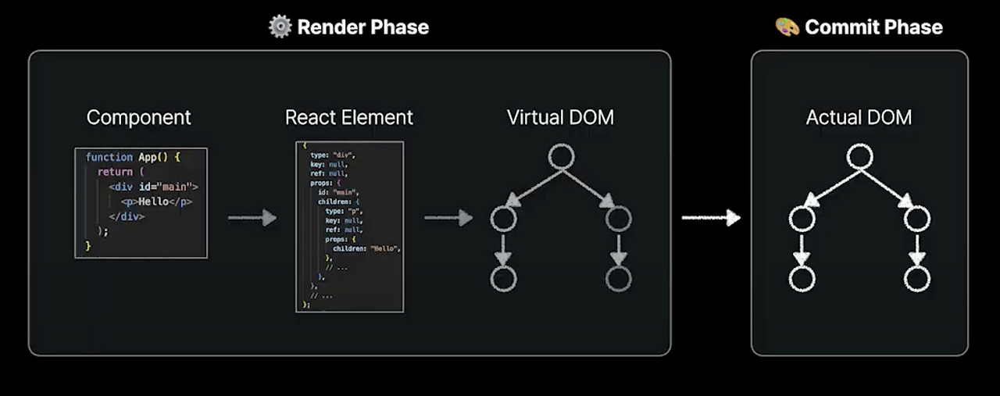
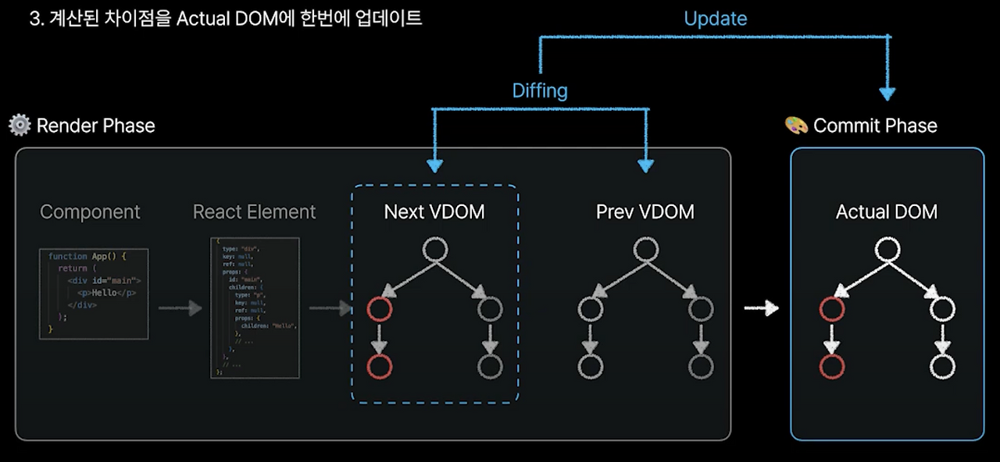

>기술세미나로 리액트 렌더링 최적화라는 주제에 대해 준비했다.  
>렌더링 최적화 방법을 소개하기 전에 브라우저와 리액트가 각각 어떤 과정을 통해 렌더링이 되는지 알아볼 필요가 있었다. 
>이에 대해 확실하게 정리하고 넘어가고자 포스팅으로 남기려고 한다.

 

브라우저는 어떻게 HTML, CSS로 작성한 웹페이지를 화면에 렌더링 하는걸까?🤔

## 브라우저 렌더링 과정
브라우저는 Critical Rendering Path(CRP)라는 과정을 통해 렌더링이 진행된다.

Critical Rendering Path(CRP)
상세 과정은 다음과 같다.

- 1단계 - HTML, CSS 변환(DOM, CSSOM 생성)

- 2단계 - Render Tree 생성

- 3단계 - Layout 과정

- 4단계 - Painting 과정

>1. HTML 파싱을 통한 DOM 생성
>2. CSS 파싱을 통한 CSSOM 생성
>3. DOM 트리와 CSSOM 트리를 결합해 렌더 트리 생성
>4. layout 과정 실행
>5. paint 및 composite 과정 실행

 

### 1단계 - HTML, CSS 변환(DOM, CSSOM 생성)

#### DOM(Document Object Model)이란?

>HTML을 브라우저가 해석하기 편한 방식으로 변환한 객체 트리

CSSOM도 DOM과 똑같이 CSS 내용을 파싱하여 노드를 만들어 트리구조로 만든 것을 말한다.

### 2단계 - Render Tree 생성

DOM 트리와 CSSOM 트리를 결합해 Render Tree를 생성한다. 이는 웹페이지의 "청사진"이라고 생각하면 된다.

### 3단계 - Layout 과정

Render Tree를 기반으로 실제 웹 페이지에 요소들의 배치를 결정하는 작업

### 4단계 - Painting 과정

실제로 요소들을 화면에 그려내는 과정

그렇다면 업데이트 과정은 어떻게 되는 걸까?🤔

### 업데이트 상황일 시,
JavaScript가 DOM을 수정하면 업데이트가 발생한다. 
DOM이 수정되면 CRP가 다시 실행이 된다.

#### ‼️여기서 Layout과 Painting 과정은 매우 비싼 과정임‼️

즉, 잦은 Reflow와 Repaint는 웹 성능 저하의 주범이 된다. 
자바스크립트 수정이 여러 번 일어나게 된다면 Reflow와 Repaint 또한 여러 번 일어나기 때문이다.

### 그래서 해결 방법이 뭔데?
렌더링 성능의 저하를 줄이기 위해, 다음 그림과 같이 동시에 일어난 다양한 업데이트를 모아서 한 번에 수정 작업을 할 수 있도록 하는 것이다.

이를 **React에서는 자동으로 해준다. 🪄**

## 리액트 렌더링 과정

리액트는 2단계를 거쳐 화면에 UI를 렌더링한다.

1. Render Phase
2. Commit Phase

### Render Phase
React 컴포넌트가 렌더링해야 하는 UI를 **Virtual DOM**이라는 객체 값으로 변환하는 과정

Render Phase는 다음 단계로 나눌 수 있다.

1. **컴포넌트를 호출해 결과값 계산**(React Component -> React Element)
2. **React Element 들을 모아 Virtual DOM 생성**(React Element -> Virtual DOM)

### 여기서 Virtual DOM(가상 돔)이란?
React Element라고 부르는 객체 값의 모임 
실제 DOM은 아니다. 복사본이라고 생각하자. 
실제 DOM과의 차이점은 브라우저에 있는 문서에 직접 접근할 수 없다는 점이다.(직접 수정 불가능!)

이 가상 돔을 이용해서 리액트는 차이가 발생한 부분만을 브라우저 상의 실제 DOM에 적용해준다. 
이 과정은 다음에 나오는 Commit Phase에 해당된다.

### Commit Phase
Virtual DOM을 Actual DOM에 반영한다. 
그 후, 위에서 다룬 브라우저 렌더링 과정의 CRP 프로세스를 거치게 된다

## 리액트 렌더링 과정 정리

#### 그렇다면 구체적으로 어떻게 DOM 업데이트를 최소화시키고 진행하는 걸까?
2개의 가상돔(이전 가상돔과 바뀐 가상돔)의 차이점을 <U>**diffing 알고리즘**</U>을 통해 알아내고 
실제 돔에 한 번에 업데이트해서 렌더링을 최적화한다. 이를 <U>**"Reconciliation(재조정)"**</U>이라고 한다.

diffing 알고리즘과 ReactFiberReconciliation 관련해서는 더 깊게 파봐야할 것 같다.

이는 따로 추후 포스팅을 해보겠다.