>Next.js와 React의 차이, Next.js의 Page Router와 App Rotuer의 차이에 대해 정리해보려고 한다. 계속 코드로만 직접 짜봤지, 머리 속에 개념 정리를 해보고자 포스팅을 해보기로 했다!

## React vs Next.js
먼저 React는 라이브러리, Next.js는 프레임워크라고 각 공식 사이트에 소개를 해놨다.


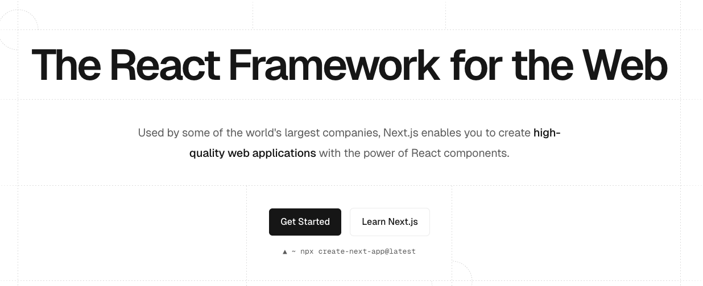

React는 UI 개발을 위한 JavaScript **라이브러리**
Next.js는 React 전용의 웹 개발 **프레임워크**

그럼 여기서 라이브러리와 프레임워크의 차이는 무엇일까?

### 라이브러리 vs 프레임워크

*기능 구현의 주도권이 누구에게 있는가?*

주도권이 개발자에게 있다면? 👉🏻 라이브러리
주도권이 개발자에게 없다면? 👉🏻 프레임워크

주도권을 개발자가 가진다면, 기능 구현을 원하는 방향으로 개발자가 만들어갈 수 있고 쓰고 싶은 도구와 기술을 마음대로 쓸 수 있다. => 자유도⬆️, 대신 개발자가 다 구현해야 함..

반대로 주도권을 프레임워크가 가진다면, 프레임워크가 제공하는 기능을 이용하고 허용하는 범위 내에서만 추가 도구를 가져가 쓸 수 있다. => 자유도⬇️, 대신 복잡한 기능들을 제공해주기에 가져다 쓰면 된다!

### CSR vs SSR

다른 차이점으로는 React는 CSR(Client Side Rendering)을, Next.js는 SSR(Server Side Rendering)이라는 특징을 가지고 있다.

이는 크게 **사전 렌더링**을 하느냐, 안하느냐의 차이가 있다.

>**사전 렌더링**이란, 브라우저의 요청에 사전에 렌더링이 완료된 HTML을 응답하는 렌더링 방식이다. CSR의 단점을 효율적으로 해결하는 기술이다!

그렇다면 CSR은 무엇일까?

### CSR(Client Side Rendering)
React.js 앱의 기본적인 렌더링 방식이다. 클라이언트(브라우저)에서 직접 화면을 렌더링한다.

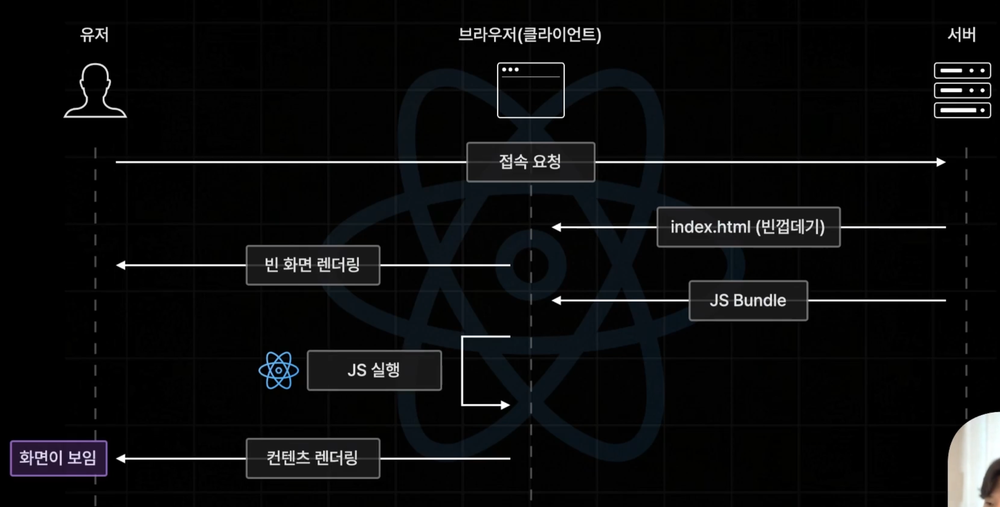
<sub>이미지 출처: 한 입 크기로 잘라먹는 Next.js</sub>

1. 유저가 브라우저를 통해 초기 접속 요청을 서버에 보내고, 리액트 웹서버는 빈껍데기인 index.html 파일을 브라우저에게 전송한다.
2. 브라우저는 서버로부터 받은 html 파일을 화면에 렌더링한다.
3. 이때, 사용자는 흰화면을 보게 된다.
4. 서버는 브라우저에게 JS 파일들을 번들링하고 이 번들링한 것을 브라우저에게 보낸다.
5. 브라우저는 이 번들링된 JS를 실행하고 이때, 리액트 앱이 구동되어 실제 화면에 나타나게 된다.
6. 결과적으로 사용자는 요청한 웹페이지를 볼 수가 있게 된다.

>CSR은 이렇듯 초기 로드에는 흰화면이 나온다는 단점이 있다. 하지만 장점으로, 페이지 이동이 매우 빠르고 쾌적하다는 특징이 있다.

왜 그럴까?🤔

이는 서버가 JS 번들링을 하고 난 후, 브라우저에게 전송했을 때 번들링된 JS 파일에는 리액트 코드들이 들어있고 즉, 해당 서비스의 모든 컴포넌트 코드들이 들어 있기 때문이다.

그렇기 때문에 이후 사용자가 다른 페이지에 접속하더라도, 브라우저가 자체적으로 리액트 앱을 실행해서 빠른 속도로 페이지 이동이 가능하게 된다!

하지만 앞서 말했듯이 **FCP(요청 시작 시점부터 컨텐츠가 처음 나타나는데 걸리는 시간)** 가 길어져 초기 접속 시간이 길다는 단점이 있다.

### SSR(Server Side Rendering)

SSR은 앞서 말한 사전 렌더링으로 CSR의 단점을 이겨낸다. 

1. 유저가 브라우저를 통해 서버에게 초기 접속 요청을 한다.
2. 서버는 직접 JS 코드(리액트 코드)를 실행해서 모든 리액트 컴포넌트들을 html로 변환(사전 렌더링)을 한다.
3. 렌더링이 완료된 후, html 파일을 그대로 브라우저에게 전송한다.
4. 브라우저는 전송 받은 html 파일을 화면에 그대로 렌더링한다.
5. 결과적으로 사용자는 요청한 웹페이지를 볼 수가 있게 된다.

정리하자면, 서버에서 바로 js를 실행해서 html 화면을 그려낸 상태로 브라우저에 보낸다는 뜻!! => *FCP 감소*

### Hydration(수화)

>브라우저는 서버로부터 html을 받고 사용자에게 넘겨준 후 사용자가 사이트에 클릭을 시도하면 작동을 하지 않게 된다... 왜그럴까?

이는 브라우저가 js 파일을 갖고 있지 않기 때문이다. 이후 서버는 JS 번들링 파일을 브라우저에게 전송하고, 그제서야 브라우저는 html과 JS를 연결시켜 실행한다. 이후, 사용자는 상호작용이 가능하게 된다!!

이렇게 html과 js를 연결시키는 과정을 **Hydration** 과정이라고 한다.

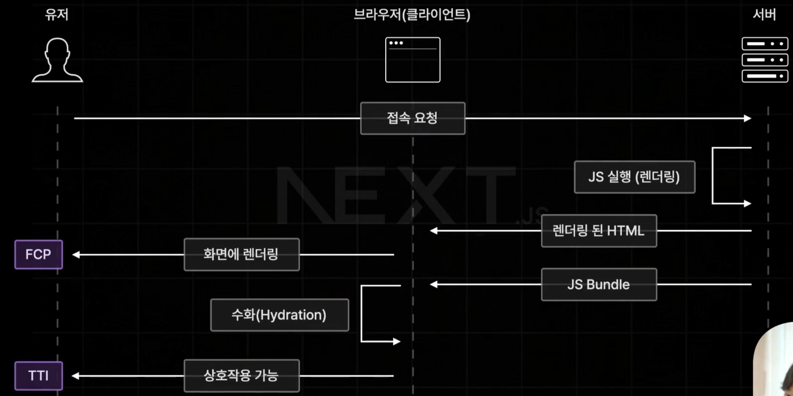
<sub>이미지 출처: 한 입 크기로 잘라먹는 Next.js</sub>

그렇기에 SSR은 초기 로드 속도가 빠르다는 장점이 있다. 또한, 이후 페이지 이동 속도도 이미 브라우저가 JS 번들링 파일을 가지고 있기 때문에 CSR과 같은 방식으로 처리된다.

결과적으로 SSR의 사전 렌더링 방식은 **빠른 FCP 달성(CSR의 단점 해소) + 빠른 페이지 이동(CSR의 장점 승계)** 의 특징을 갖게 된다. 🥳🎉

---

## Page Router
>현재 많은 기업에서 사용되고 있는 안정적인 라우터

Page Router는 pages 폴더의 구조를 기반으로 페이지 라우팅을 제공한다.

파일명 또는 폴더명 기반의 라우팅을 가진다.

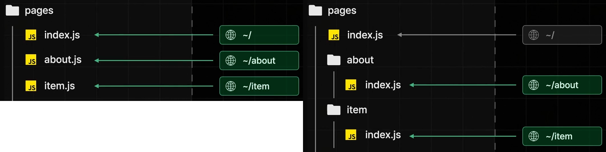

동적 라우팅은 대괄호로 동적 파일명을 만들어주면 된다.

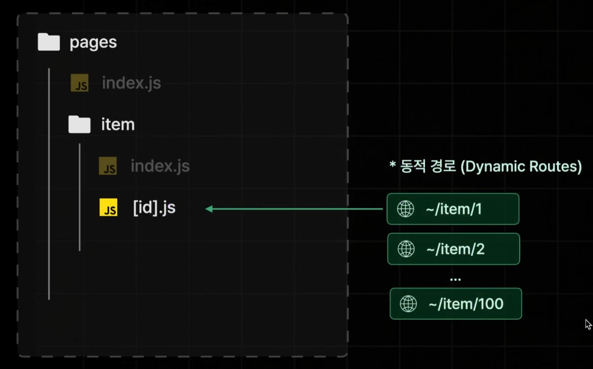

### _app.tsx와 _docupent.tsx의 역할
pages 폴더 안에 있는 이 두 파일은 페이지의 역할을 하지 않는다. next 프로젝트의 모든 페이지에 적용할 공통된 로직이나 레이아웃, 데이터에 대해 필요한 파일들이다.

**_app.tsx**

React에서의 App 컴포넌트와 같은 개념이다. 즉, 루트 컴포넌트로 생각하면 된다. 여기서 공통 레이아웃과 비즈니스 로직을 작성할 수 있다. 

**_docupent.tsx**

모든 페이지에 공통으로 적용되어야 하는 next 앱의 html 코드를 설정하는 컴포넌트이다. React 앱의 index.html과 같은 개념이다. 여기서 메타 태그나 폰트, 서드파티 script 등을 넣을 수 있다.

### 중첩 라우터
중첩 라우팅을 하고 싶다면 폴더명 기반 라우팅 방식에서 원하는 파일명의 새 파일을 만들면 그 파일명이 중첩 라우팅이 된다.(당연히 이때 파일명이 아닌 폴더명 기반으로 새 폴더를 만들고 index.tsx를 만들어도 가능하다.)

### useRouter
보통 원하는 검색어를 입력할 때 쿼리 스트링이라는 형태로 데이터가 전달되는데 이 쿼리 스트링의 값을 꺼내서 사용하기 위해 next/router의 useRouter를 활용한다.

>근데? next/router와 next/navigation이 있다. 둘의 차이는 뭘까?🤔

next/navigation은 App router에서 사용되는 패키지다. useSearchParams를 활용한다. Page 라우터에서는 next/router의 useRouter로 불러올 수 있으니 둘의 차이를 잊지 말자.

*useRouter()* 를 콘솔로 찍어보면 다음처럼 나온다.
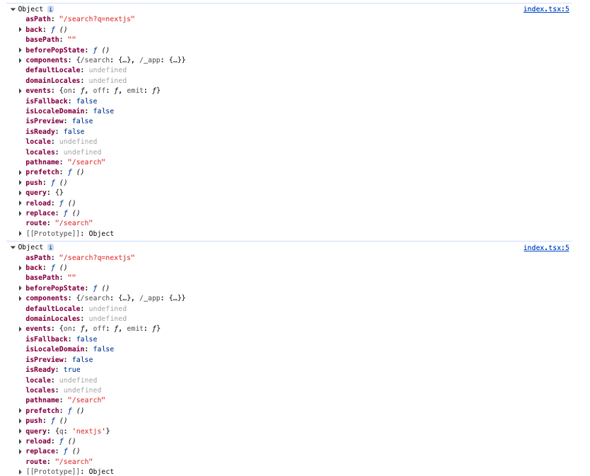

위 사진을 보면 한 콘솔에 굉장히 많은 프로퍼티가 찍힌 걸 확인할 수 있다. back과 push처럼 다른 경로로 이동하는 메서드, 쿼리 스트링을 받아오는 query 등이 들어있다.

> 근데 왜 콘솔이 두 번 찍혔는가?
자세히 보면 query에 차이가 있다. next 앱이 쿼리 스트링을 읽으면서 컴포넌트를 한 번 더 렌더링하기 때문이다.

### 동적 라우팅
파일명에 대괄호로 감싸면, 이는 동적 라우팅을 할 수 있는데 보통 id, slug 등으로 많이 쓴다.

pages/book/[id].tsx로 파일을 만들면, `/book/{id}` 형태로 페이지가 동적으로 만들어진다.

>여기서 만약 `/book/{id}/{id2}/{di3}` 이런 식의 뒤에 라우팅이 더 붙으면 어떻게 될까?

없는 페이지로 뜬다.(404)

이를 해결하기 위해선, Catch-all Segments를 사용하면 된다.

### Catch-all Segments
[id].tsx를 [...id].tsx로 바꿔보자.

`pages/shop/[...slug].js`는 `/shop/clothes`와 `/shop/clothes/tops`, `/shop/clothes/tops/t-shirts` 모두 포함한다.

**Catch-all Segments**

근데 여기서 `/shop` 경로로 들어가면, 404 페이지가 뜬다. 만약 뒤에 추가 경로가 붙든 안붙든 조건 없이 사용하고 싶다면 `[[...slug]].tsx`처럼 대괄호로 한 번 더 감싸주면 된다.

### Pre-Fetching
사용자가 현재 보고 있는 페이지에서 이동할 수 있는 모든 페이지를 사전에 미리 불러오는 것을 의미한다.

>근데 분명 Next.js는 html을 사전 렌더링 하고 이후 서버가 js 번들링 된걸 보내서 페이지 이동 시에 CSR 방식으로 브라우저가 js를 실행해서 빠르게 이동된다고 했는데 Pre-Fetching은 왜 필요한걸까?🤔

Next.js는 js 파일들을 페이지별로 미리 스플리팅해서 저장을 해둔다. 즉, 질문에서 말한 서버가 js 번들링 된 걸 보낸다는 것은 <ins>해당 페이지의 스플리팅된 번들링 파일이라는 것</ins>이다!

만약 이렇게 하지 않고 모든 페이지의 js 파일을 던져주게 되면, 용량이 커지고 하이드레이션이 늦어진다. 그러면 사용자가 상호작용할 수 있는 시간(TTI)이 늦어지게 된다.

이후, 다른 페이지로 이동하게 될 때 해당 페이지가 필요로 하는 js 번들링을 서버로부터 또 받아와야 하는데 이런 경우, 하이드레이션 면에서는 좋을지라도 페이지 이동은 느려지고 비효율적이게 된다.

이런 문제를 해결하기 위해 `Pre-Fetchig`이 있는 것이다.

프리패칭은 초기 접속이 끝난 후, 다음 페이지 이동이 이루어지기 전에 연결된 모든 페이지의 Js 번들 파일을 불러오게 된다.

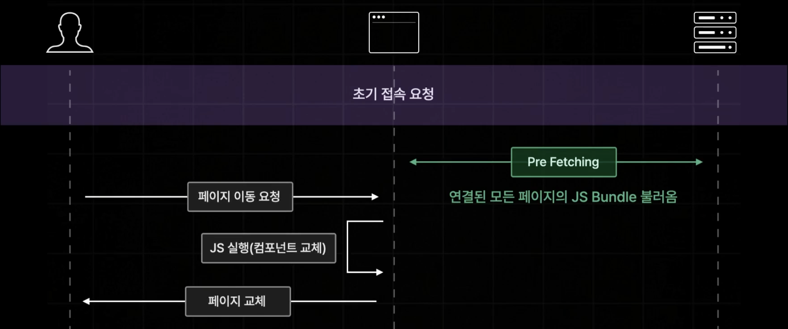

>참고로 프리패칭은 dev 모드에서는 일어나지 않는다. production 모드에서 확인할 수 있다! 그러니 빌드하고 운영 환경에서 확인해보자.

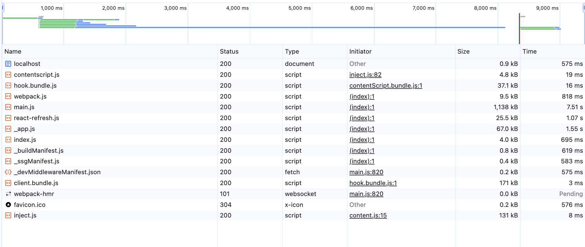

dev 모드일 때 네트워크 탭이다. search와 book 페이지의 js 파일들이 보이지 않는다.

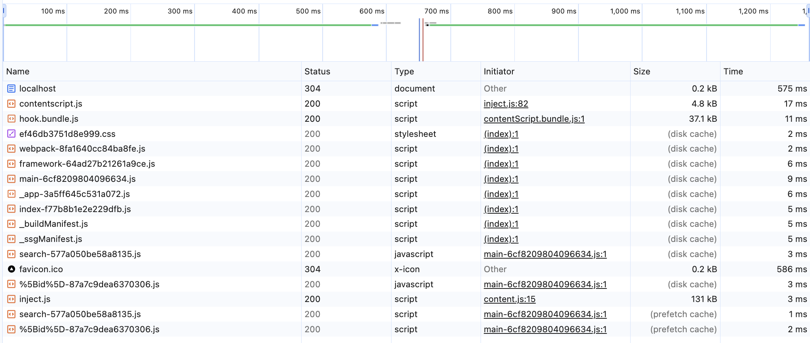

prod 모드일 때 네트워크 탭이다. search와 book 페이지의 js 파일들이 보이는 것을 확인했다. 프리패칭이 제대로 이루어진 것이다.

여기서 또 하나의 문제를 볼 수 있다. 현재 코드는 다음과 같다.


```tsx
export default function App({ Component, pageProps }: AppProps) {
  const router = useRouter();

  const onClickButton = () => {
    router.push("/test");
  };

  return (
    <>
      <header>
        <Link href="/">홈</Link>
        &nbsp;
        <Link href="/search">검색</Link>
        &nbsp;
        <Link href="/book/1">책 1</Link>
        <div>
          <button onClick={onClickButton}>/test 페이지로 이동</button>
        </div>
      </header>
      <Component {...pageProps} />
    </>
  );
}
```

여기서 Link로 감싸진 페이징에 대해서는 프리패칭이 잘 이루어지는데, /test 페이지에 대해서는 프리패칭이 이루어지지 않는다. 즉, /test로 페이지 이동 시, test js 파일이 새로 네트워크 탭에 불러와진다.

>router.push 페이징 처리한 것도 프리패칭이 되게 하려면 어떻게 해야할까?

App 컴포넌트가 마운트되었을 때(처음 화면에 그려졌을 때) 프리패치 하도록 하면 된다.

코드는 다음 걸 로직에 추가하면 된다.

```tsx
useEffect(() => {
  router.prefetch('/test');
}, [])
```

>반대로 Link 태그의 prefetch를 해제하고 싶은면?

`prefetch={false}` 속성을 추가해주면 된다.

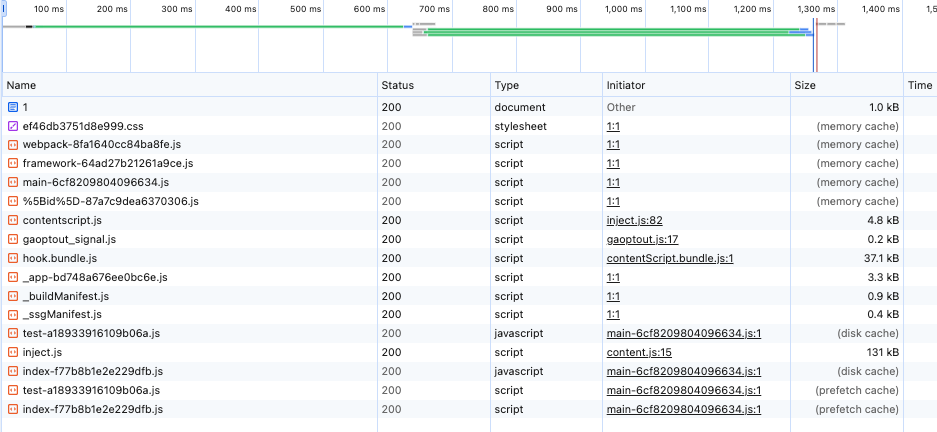

test js의 프리패칭, search js의 프리패칭 해제를 확인할 수 있다!

### API Routes
Next.js에서 API를 구축할 수 있게 해주는 기능

`/pages/api` 폴더 안에 파일을 만들면, 그 **파일 경로 = API 엔드포인트**가 된다.

예를 들어  
- `pages/api/hello.ts` → `GET /api/hello`  
- `pages/api/user/index.ts` → `GET /api/user`  
- `pages/api/user/[id].ts` → `GET /api/user/123` 이런 식으로 동적 라우팅도 가능하다.

기본 형태는 다음과 같다:

```ts
// pages/api/hello.ts
import type { NextApiRequest, NextApiResponse } from 'next';

export default function handler(req: NextApiRequest, res: NextApiResponse) {
  // 요청 메서드에 따라 분기
  if (req.method === 'GET') {
    return res.status(200).json({ message: 'Hello API' });
  }

  // 허용하지 않는 메서드 처리
  res.setHeader('Allow', ['GET']);
  return res.status(405).end('Method Not Allowed');
}
```

> ### CSS Module 방식이란?
>페이지 별로 클래스 네임이 겹쳐서 발생할 수 있는 문제(스타일 충돌)를 자동으로 유니크한 클래스 네임으로 변환해줌으로써 해결한 방식이다.

### SSR, SSG, ISR
Next.js는 세 가지의 사전 렌더링 방식이 있다.

***SSR(Server Side Rendering)***

- 가장 기본적인 사전 렌더링 방식
- 요청이 들어올 때마다 사전 렌저링을 진행

SSR은 페이지 내부의 데이터를 항상 최신으로 유지할 수 있다는 장점이 있지만,
데이터 요청이 늦어질 경우 모든 게 늦어진다는 단점이 있다.

```ts
export const getServerSideProps = async (
  context: GetServerSidePropsContext
) => {
  const id = context.params!.id;
  const book = await fetchOneBook(Number(id));

  return {
    props: { book },
  };
};
```

***SSG(Static Site Generation)***

- SSR의 단점을 해결하는 사전 렌더링 방식
- 빌드 타임에 페이지를 미리 사전 렌더링 해 둠

SSG 방식은 사전 렌더링에 많은 시간이 소요되더라도 사용자의 요청에는 매우 빠른 속도로 응답한다는 장점이 있다.

하지만, 매번 똑같은 페이지만 응답하기에 최신 데이터 반영은 어렵다는 단점이 있다.

>제대로된 SSG 동작을 확인하기 위해 꼭 운영 환경에서 테스트를 해보자!

```ts
export const getStaticProps = async () => {
  const [allBooks, recoBooks] = await Promise.all([
    fetchBooks(),
    fetchRandomBooks(),
  ]);

  return {
    props: {
      allBooks,
      recoBooks,
    },
  };
};
```

만약 동적 경로를 가진 파일을 SSG로 불러온다면 어떻게 해야 핳까? 위처럼 getStaticProps를 이용해서 실행을 해보면 다음과 같이 에러가 난다.

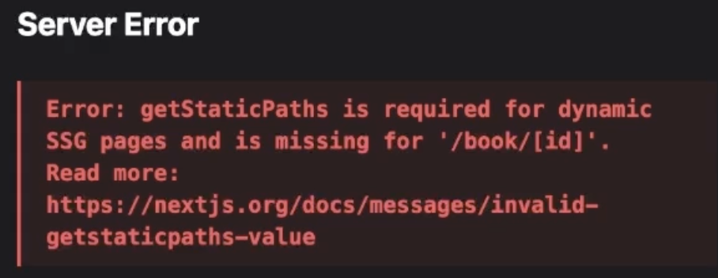

빌드타임에 사전렌더링을 진행하기 때문에 어떤 경로들이 존재할 수 있는지 알 수 있도록 설정하는 과정이 필요한 것이다.

이 설정하는 역할을 함수가 바로 `getStaticPaths`이다. 

```ts
export const getStaticPaths = () => {
  return {
    paths: [
      { params: { id: "1" } },
      { params: { id: "2" } },
      { params: { id: "3" } },
    ],
    fallback: true,
    // false - 404 NotFound
    // blocking - SSR 방식
    // true - SSR 방식 + 데이터가 없는 폴백 상태의 페이지부터 반환
  };
};

export const getStaticProps = async (context: GetStaticPropsContext) => {
  const id = context.params!.id;
  const book = await fetchOneBook(Number(id));

  return {
    props: { book },
  };
};
```

> 여기서 fallback 옵션은 무엇일까?

fallback은 존재하지 않는 경로로 들어갔을 때 어떻게 대체할 지 설정하는 옵션이다.

`false`일 때는 **404 NotFound**를, <br/> `true`일 때는 **SSR 방식으로 업데이트를 진행하되, 사용자가 반응을 빠르게 확인할 수 있게 데이터가 없는 폴백 상태 페이지부터 반환**,  <br/> `blocking`은 **SSR 방식**으로 업데이트만 진행하는 옵션이다.

***ISR(Static Site Generation)***

SSG 방식으로 생성된 정적 페이지를 일정 시간을 주기로 다시 생성하는 방식이다.

즉, 빠른 응답을 해주는 SSG의 장점과 최신 데이터 반영이 가능한 SSR의 장점을 모두 지닌 방식이라고 할 수 있다.

근데 만약 사용자가 게시글 수정과 같은 어떤 특정한 행동 이후에 즉시 업데이트가 되어야 할 때는 어떻게 해야 할까?

이는 On-Demand ISR로 Next.js 서버에 직접 revalidate 요청 날려주면 된다.

```ts
import { NextApiRequest, NextApiResponse } from "next";

export default async function handler(
  req: NextApiRequest,
  res: NextApiResponse
) {
  try {
    await res.revalidate("/");
    return res.json({ revalidate: true });
  } catch (err) {
    console.log(err);
    res.status(500).send("Revalidation Failed");
  }
}
```

### Page Router의 장단점
페이지 라우팅의 장점을 먼저 정리해보자.

| 장점 | 단점 |
| :---: | :---: |
|파일 시스템 기반 간편한 페이지 라우팅 제공|번거로운 페이지별 레이아웃 설정|
|다양한 방식의 사전 렌더링 제공|패이지 컴포넌트에 집중되는 데이터 패칭|
| - |불필요한 컴포넌트도 JS 번들에 포함|

여기서 페이지 라우터의 단점을 보완한 App Router가 등장하게 된다.

다음엔 App Router에 대해 정리하겠습니당👋🏻